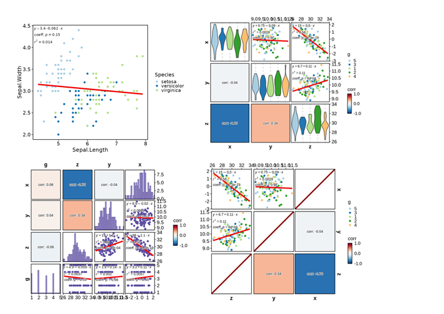
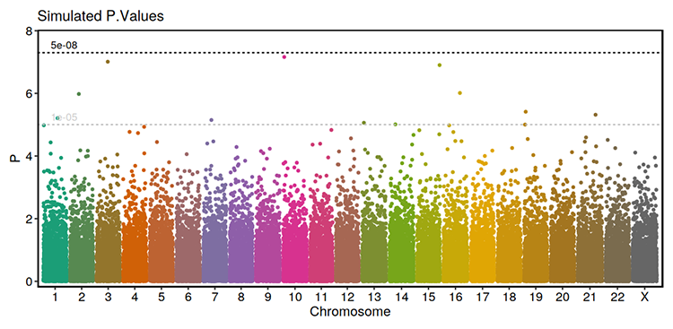

# plotthis <a href="https://pwwang.github.io/plotthis/"></a>

`plotthis` is an R package that is built upon `ggplot2` and other plotting packages. It provides high-level APIs and a wide range of options to create stunning, publication-quality plots effortlessly.

## Installation

```r
install.packages("plotthis")
# or to install the latest version:
remotes::install_github("pwwang/plotthis")
devtools::install_github("pwwang/plotthis")
```

You can also install the package using `conda`:

```
$ conda install pwwang::r-plotthis
```

## Credits

`plotthis` is greatly inspired by the [`SCP`][1] package, but with the plotting functions detached from the Seurat object or single-cell data analysis. It is designed to be more flexible and general-purpose, and can be used for a wide range of data types and analysis scenarios.

## Gallery
[`AreaPlot`][2] / [`TrendPlot`][3] / [`ROCCurve`][28]


[`ClustreePlot`][4] / [`LinePlot`][5] / [`Network`][27]


[`Heatmap`][6]


[CorPlot][24] / [CorPairsPlot][25]



[`PieChart`][7] / [`RingPlot`][8] / [`QQPlot`][29]


[`VolcanoPlot`][9] / [`WordCloudPlot`][10]


[`BarPlot`][11] / [`SplitBarPlot`][11]


[`BoxPlot`][12] / [`ViolinPlot`][12]


[`ChordPlot`][13] / [`UpsetPlot`][14] / [`VennDiagram`][15]


[`DensityPlot`][16] / [`Histogram`][16] / [`RidgePlot`][23]


[`DimPlot`][17] / [`FeatureDimPlot`][17]


[`DotPlot`][18] / [`ScatterPlot`][18] / [`LollipopPlot`][18]


[`EnrichMap`][19] / [`EnrichNetwork`][19]


[`GSEASummaryPlot`][20] / [`GSEAPlot`][20]


[`RadarPlot`][21] / [`SpiderPlot`][21] / [`RarefactionPlot`][26]


[`SankeyPlot`][22] / [`AlluvialPlot`][22]


[`ManhattanPlot`][30]



[`SpatImagePlot`][31] / [`SpatMasksPlot`][31] / [`SpatShapesPlot`][31] / [`SpatPointsPlot`][31]


[1]: https://zhanghao-njmu.github.io/SCP/index.html
[2]: https://pwwang.github.io/plotthis/reference/AreaPlot.html
[3]: https://pwwang.github.io/plotthis/reference/TrendPlot.html
[4]: https://pwwang.github.io/plotthis/reference/ClustreePlot.html
[5]: https://pwwang.github.io/plotthis/reference/LinePlot.html
[6]: https://pwwang.github.io/plotthis/reference/Heatmap.html
[7]: https://pwwang.github.io/plotthis/reference/PieChart.html
[8]: https://pwwang.github.io/plotthis/reference/RingPlot.html
[9]: https://pwwang.github.io/plotthis/reference/VolcanoPlot.html
[10]: https://pwwang.github.io/plotthis/reference/WordCloudPlot.html
[11]: https://pwwang.github.io/plotthis/reference/barplot.html
[12]: https://pwwang.github.io/plotthis/reference/boxviolinplot.html
[13]: https://pwwang.github.io/plotthis/reference/chordplot.html
[14]: https://pwwang.github.io/plotthis/reference/upsetplot1.html
[15]: https://pwwang.github.io/plotthis/reference/venndiagram1.html
[16]: https://pwwang.github.io/plotthis/reference/densityhistoplot.html
[17]: https://pwwang.github.io/plotthis/reference/dimplot.html
[18]: https://pwwang.github.io/plotthis/reference/dotplot.html
[19]: https://pwwang.github.io/plotthis/reference/enrichmap1.html
[20]: https://pwwang.github.io/plotthis/reference/gsea.html
[21]: https://pwwang.github.io/plotthis/reference/radarplot.html
[22]: https://pwwang.github.io/plotthis/reference/sankeyplot.html
[23]: https://pwwang.github.io/plotthis/reference/RidgePlot.html
[24]: https://pwwang.github.io/plotthis/reference/CorPlot.html
[25]: https://pwwang.github.io/plotthis/reference/CorPairsPlot.html
[26]: https://pwwang.github.io/plotthis/reference/RarefactionPlot.html
[27]: https://pwwang.github.io/plotthis/reference/Network.html
[28]: https://pwwang.github.io/plotthis/reference/ROCCurve.html
[29]: https://pwwang.github.io/plotthis/reference/QQPlot.html
[30]: https://pwwang.github.io/plotthis/reference/ManhattanPlot.html
[31]: https://pwwang.github.io/plotthis/reference/spatialplots.html
