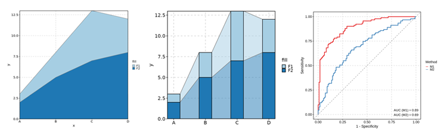
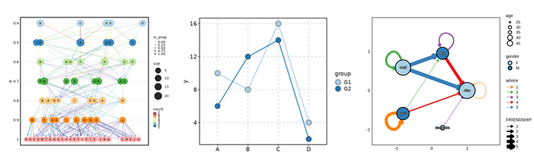
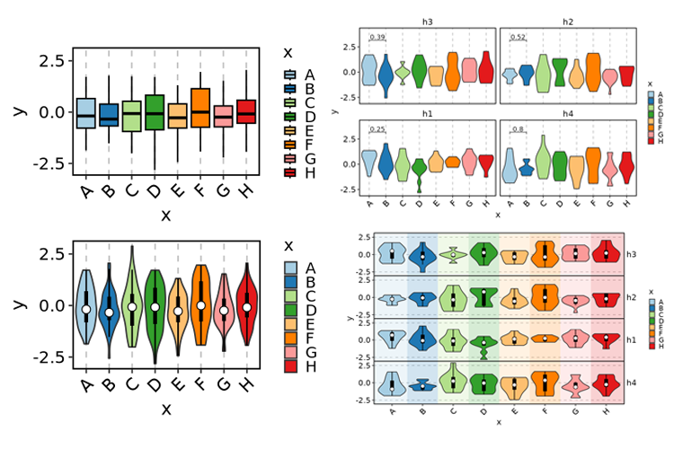
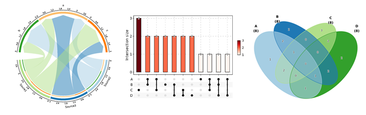
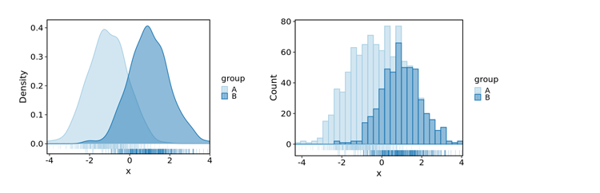
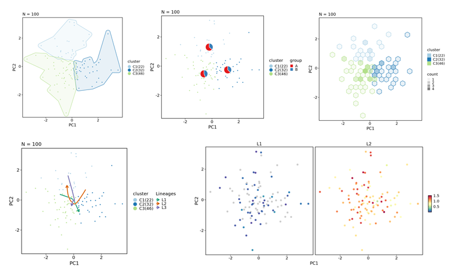
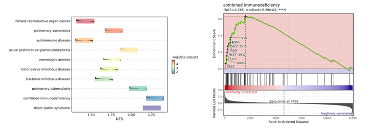
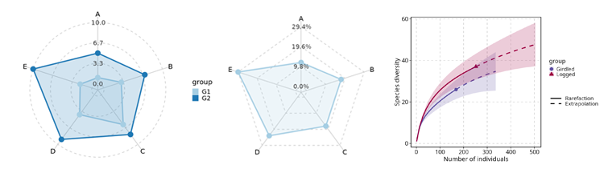
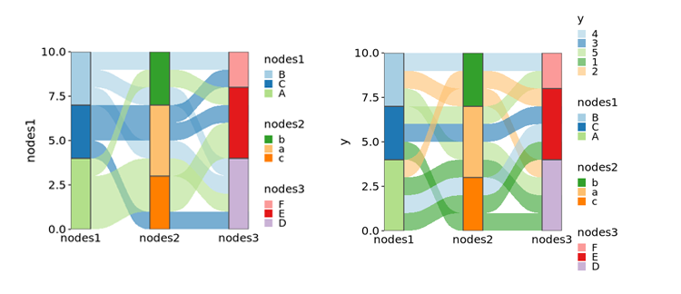

# plotthis <a href="https://pwwang.github.io/plotthis/"></a>

`plotthis` is an R package that is built upon `ggplot2` and other plotting packages. It provides high-level APIs and a wide range of options to create stunning, publication-quality plots effortlessly.

## Installation

```r
remotes::install_github("pwwang/plotthis")
```

## Credits

`plotthis` is greatly inspired by the [`SCP`][1] package, but with the plotting functions detached from the Seurat object or single-cell data analysis. It is designed to be more flexible and general-purpose, and can be used for a wide range of data types and analysis scenarios.

## Gallery

`AreaPlot` / `TrendPlot`



`ClustreePlot` / `LinePlot`



`Heatmap`


`PieChart` / `RingPlots`


`VolcanoPlot` / `WordCloudPlot`


`BarPlot` / `SplitBarPlot`


`BoxPlot` / `ViolinPlot`



`ChordPlot` / `UpsetPlot` / `VennDiagram`



`DensityPlot` / `Histogram`



`DimPlot` / `FeatureDimPlot`



`DotPlot` / `ScatterPlot` / `LollipopPlot`


`EnrichMap` / `EnrichNetwork`


`GSEASummaryPlot` / `GSEAPlot`



`RadarPlot` / `SpiderPlot`



`SankeyPlot` / `AlluvialPlot`



[1]: https://zhanghao-njmu.github.io/SCP/index.html