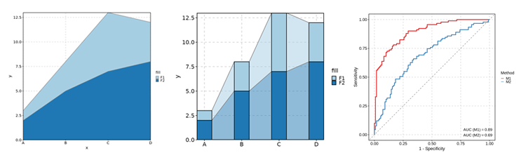
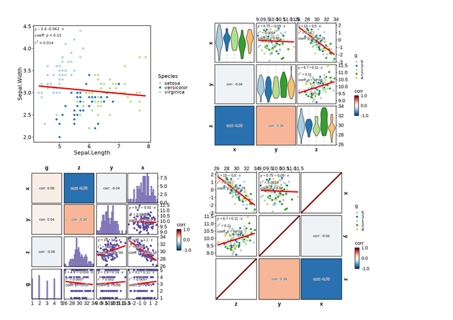
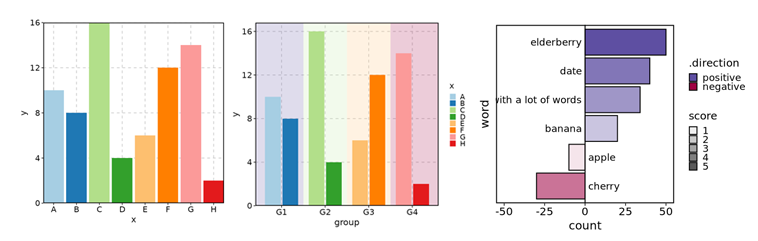
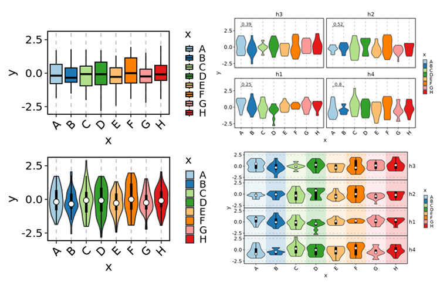
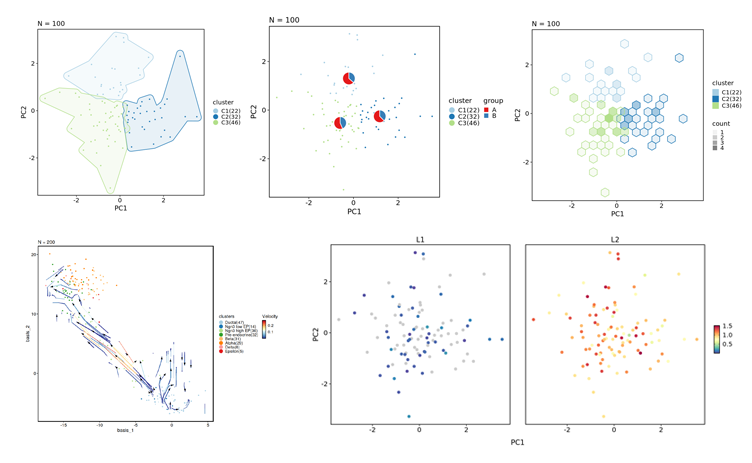
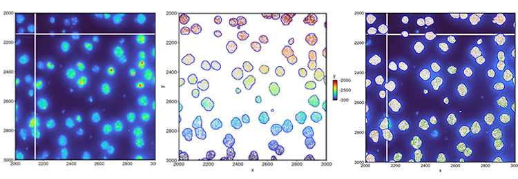

# plotthis

`plotthis` is an R package that is built upon `ggplot2` and other
plotting packages. It provides high-level APIs and a wide range of
options to create stunning, publication-quality plots effortlessly.

## Installation

``` r
install.packages("plotthis")
# or to install the latest version:
remotes::install_github("pwwang/plotthis")
devtools::install_github("pwwang/plotthis")
```

You can also install the package using `conda`:

    $ conda install pwwang::r-plotthis

## Gallery

[`AreaPlot`](https://pwwang.github.io/plotthis/reference/AreaPlot.html)
/
[`TrendPlot`](https://pwwang.github.io/plotthis/reference/TrendPlot.html)
/
[`ROCCurve`](https://pwwang.github.io/plotthis/reference/ROCCurve.html)



[`ClustreePlot`](https://pwwang.github.io/plotthis/reference/ClustreePlot.html)
/
[`LinePlot`](https://pwwang.github.io/plotthis/reference/LinePlot.html)
/ [`Network`](https://pwwang.github.io/plotthis/reference/Network.html)


[`Heatmap`](https://pwwang.github.io/plotthis/reference/Heatmap.html)


[CorPlot](https://pwwang.github.io/plotthis/reference/CorPlot.html) /
[CorPairsPlot](https://pwwang.github.io/plotthis/reference/CorPairsPlot.html)



[`PieChart`](https://pwwang.github.io/plotthis/reference/PieChart.html)
/
[`RingPlot`](https://pwwang.github.io/plotthis/reference/RingPlot.html)
/ [`QQPlot`](https://pwwang.github.io/plotthis/reference/QQPlot.html)


[`VolcanoPlot`](https://pwwang.github.io/plotthis/reference/VolcanoPlot.html)
/
[`WordCloudPlot`](https://pwwang.github.io/plotthis/reference/WordCloudPlot.html)


[`BarPlot`](https://pwwang.github.io/plotthis/reference/barplot.html) /
[`SplitBarPlot`](https://pwwang.github.io/plotthis/reference/barplot.html)



[`BoxPlot`](https://pwwang.github.io/plotthis/reference/boxviolinplot.html)
/
[`ViolinPlot`](https://pwwang.github.io/plotthis/reference/boxviolinplot.html)



[`ChordPlot`](https://pwwang.github.io/plotthis/reference/chordplot.html)
/
[`UpsetPlot`](https://pwwang.github.io/plotthis/reference/upsetplot1.html)
/
[`VennDiagram`](https://pwwang.github.io/plotthis/reference/venndiagram1.html)


[`DensityPlot`](https://pwwang.github.io/plotthis/reference/densityhistoplot.html)
/
[`Histogram`](https://pwwang.github.io/plotthis/reference/densityhistoplot.html)
/
[`RidgePlot`](https://pwwang.github.io/plotthis/reference/RidgePlot.html)


[`DimPlot`](https://pwwang.github.io/plotthis/reference/dimplot.html) /
[`FeatureDimPlot`](https://pwwang.github.io/plotthis/reference/dimplot.html)
/
[`VelocityPlot`](https://pwwang.github.io/plotthis/reference/VelocityPlot.html)



[`DotPlot`](https://pwwang.github.io/plotthis/reference/dotplot.html) /
[`ScatterPlot`](https://pwwang.github.io/plotthis/reference/dotplot.html)
/
[`LollipopPlot`](https://pwwang.github.io/plotthis/reference/dotplot.html)


[`EnrichMap`](https://pwwang.github.io/plotthis/reference/enrichmap1.html)
/
[`EnrichNetwork`](https://pwwang.github.io/plotthis/reference/enrichmap1.html)


[`GSEASummaryPlot`](https://pwwang.github.io/plotthis/reference/gsea.html)
/ [`GSEAPlot`](https://pwwang.github.io/plotthis/reference/gsea.html)


[`RadarPlot`](https://pwwang.github.io/plotthis/reference/radarplot.html)
/
[`SpiderPlot`](https://pwwang.github.io/plotthis/reference/radarplot.html)
/
[`RarefactionPlot`](https://pwwang.github.io/plotthis/reference/RarefactionPlot.html)


[`SankeyPlot`](https://pwwang.github.io/plotthis/reference/sankeyplot.html)
/
[`AlluvialPlot`](https://pwwang.github.io/plotthis/reference/sankeyplot.html)


[`ManhattanPlot`](https://pwwang.github.io/plotthis/reference/ManhattanPlot.html)


[`SpatImagePlot`](https://pwwang.github.io/plotthis/reference/spatialplots.html)
/
[`SpatMasksPlot`](https://pwwang.github.io/plotthis/reference/spatialplots.html)
/
[`SpatShapesPlot`](https://pwwang.github.io/plotthis/reference/spatialplots.html)
/
[`SpatPointsPlot`](https://pwwang.github.io/plotthis/reference/spatialplots.html)



## Credits

`plotthis` is greatly inspired by the
[`SCP`](https://zhanghao-njmu.github.io/SCP/index.html) package, but
with the plotting functions detached from the Seurat object or
single-cell data analysis. It is designed to be more flexible and
general-purpose, and can be used for a wide range of data types and
analysis scenarios.
